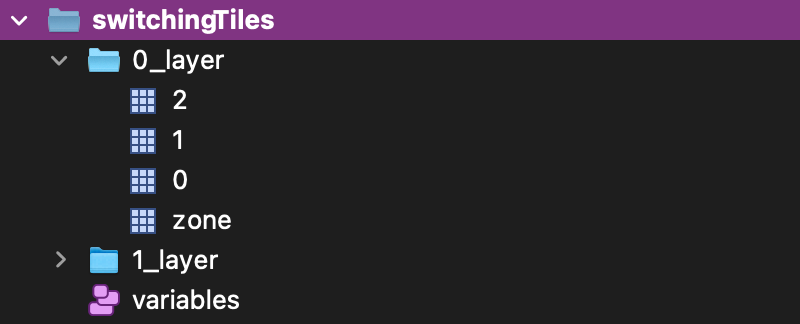
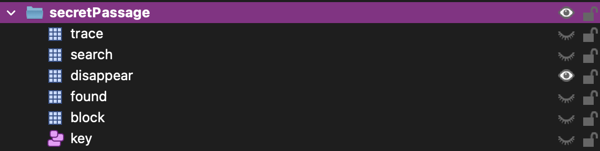
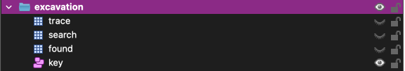
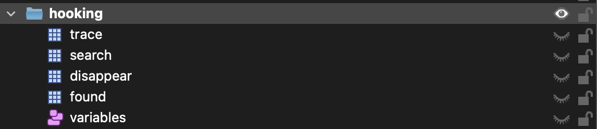

# How to use modules

## Switching tiles
### Description
This module is used to put groups of tiles composed of several tiles whose design can be changed by walking on it.
You can determine a victory condition, which allows to trigger a callback
(**example :** When the displayed drawings are those expected, a door opens)

### Map setup
In your map, on Tiled, you must create a group of layers with the name of your choice.
In this group:
- As many layer groups as you want tiles (in this file it's called **switchingTileGroup**)
  - Each one must be called "[no]_layer" (**ex :** "1_layer")
  - Each one must contain one layer called "zone". This is the area that, when the player steps on it, will change the drawing of the switchingTileGroup.
  - Each one must contain as many layers (in this file it's called **drawingLayer**) as you have drawings (one layer = one drawing). Call it with a numero (the numero if the drawing you want to display). You must place the tiles on each layer at the place you want it to be
- you must create an object layer named "variables" with :
  - A variable named **"[name_of_your_group]VictoryCondition"** (ex: if your group name is **"switchingTiles"**, then the variable name is **"switchingTilesVictoryCondition"**)
    - Type : string
    - Default value : A json string containing your victory condition
    - `{ [drawingLayer_no]: [drawing_no] }`
    - ex : `{ "0" : "1", "1" : "2" }`
  - A variable named **"[name_of_your_group]TilesNumber"** (ex: if your group name is **"switchingTiles"**, then the variable name is **"switchingTilesTilesNumber"**)
    - Type : number
    - Default value : Number of differents drawing for the tiles
  - A variable named **"[name_of_your_group]IsVictory"** (ex: if your group name is **"switchingTiles"**, then the variable name is **"switchingTilesIsVictory"**)
      - Type : Boolean
      - Default value : false
  - As many variables as you have switchingTileGroups called "switchingTiles_[switchingTileGroup_no]_value"
    - Type: number
    - Default value : The drawingLayer no that you want to be showed at first for this switchingTileGroup


  

_NOTE : If you need several layers for one switchingTileGroup (for example for a tile switching under the WOKA and another up), you can create several groups named the same way (in our case **"switchingTiles"**)
and put inside the top layers you want with a number at the end like this: [nb]_layer_[layer_nb] (for example **'1_layer_1'**) and put inside as many drawingLayer as you want._
  


_You can have 3 more layer for one switchingTileGroup (1_layer_1, 1_layer_2, 1_layer_3)_

### Code setup
In map's script, you can use two functions : 
- **initiateSwitchingTiles :** will create several switchingTilesGroup wich will change when walking on zone
- **setSwitchingTile :** will create only one switchingTilesGroup, but you can set an action message to change the tile

initiateSwitchingTiles :
```typescript
import { switchingTiles } from './modules'

// Waiting for the API to be ready
WA.onInit().then(() => {
  // Parameters:
    // switchingTiles: Array<string> --> List of switching tiles groups names
    // victoryCallBacks: Array<Function> --> List of callbacks to call when victory for each group
  switchingTiles.initiateSwitchingTiles(
    ['switchingTiles'], 
    [() => console.log('OK !')
  ])
})
```

setSwitchingtiles:
```typescript
import { switchingTiles } from './modules'

// Waiting for the API to be ready
WA.onInit().then(() => {
  // Parameters:
    // switchingTiles: Array<string> --> List of switching tiles groups names
    // victoryCallBacks: Array<Function> --> List of callbacks to call when victory for each group
  switchingTiles.setSwitchingTile(
    'switchingTiles', 
    () => console.log('OK !'), 
    true, // must display action messgae ? (default : false)
    'my.action.translation.key' // translation key of the action message displayed
  )
})
```

## Hidden Zones
### Description
This module is used to erase a layer when you walk in a specific area, and to display it again when you leave it.
This can be useful, for example, if you want to make rooms inside buildings that you can't see from the outside.

### Map setup
You must create two layers (name it as you want): 
- A layer that will be used to hide the other layer when walking on it
- The other layer that will desapear when walking on the first one (NOTE : you can make a group with several layers if needed)

### Code setup
In order to initiate hidden zones, you must use hiddenZone module in your map's script.
You must call the function **initiateHiddenZones** and give it as parameter an array of objects with type hiddenZoneType : 
```typescript
type hiddenZoneType = {
  stepIn: string,
  hide: string
}
```

This type is composed by two strings : 
- stepIn : the name of the first layer (hide the other layer when walking on it)
- hide : the name of the second layer (or the name of the group of layer) that will be hidden

In your map's script : 

```typescript
import { hiddenZone } from './modules'

WA.onInit().then(() => {
  hiddenZone.initiateHiddenZones([{stepIn: 'stepInZoneName', hide: 'hideZoneName'}])
})
```

## Job
### Description
This modules is used to assign roles to players. Thanks to this, we can retrieve their characteristics and assign them permissions.

### Code setup
In order to prepare jobs use, in your map's script :

```typescript
import { job } from './modules'

WA.onInit().then(() => {
  // Job initialisation
  job.initiateJob()
})
```

### What we can do
With this module, you can use different functions :
- **initiateJob :** Job initialisation. If you want to use jobs, you MUST call this function at the begining of your map's script
- **setPlayerJob(newJob: Job) :** Assign the job passed in parameters to the current user
- **getPlayerJob :** Get the job of the current user
- **resetPlayerJob :** Reset the job of the current player (set to null)
- **canUser(permissionName: Permissions) :** Know if a user has a certain permission (returns boolean)
- **getUserPermissions() :** Retrieve a list of user's permissions
- **askForJobWalletWebsiteClose() :** When calling initiateJob function, a button to open a website giving all his characteristics to te user is displayed.
This function allows to close the website from inside the website. It's called in the view displayed when clicking on the button and, normally, you shouldn't call it elsewhere.

## Secret passages

**NOTE :** To use this module, you **MUST** use the **Job module** too because only some users are allowed to discover secret passages

**NOTE :** To use this module, you **MUST** define **mapWidth** variable (int) and **mapHeight variable** (int). It's the number of tiles in height and width of the map.

### Description
This module allows some users to discover secret passages depending on their permissions.

### Map setup
In your map, on Tiled, you must create a group of layers with the name of your choice (in this file, we will call it **secretPassageGroup**).
If you need several groups (one under the user and another up), then name both groups the same way.
In your group(s) :
- create a layer named **"trace"** : Can be a group if needed. Display the trace of the secret passage so user can see there is something here
- create a layer named **"search"** : Can be a group if needed. Animation of searching - Hidden by default, shown during some seconds while searching
- create a layer named **"disappear"** : Can be a group if needed. Displayed when secret passage is not discovered. Hidden if secret passage is discovered
- create a layer named **"found"** : Can be a group if needed. Displayed if the secret passage has been discovered. Hidden if the secret passage has not been discovered yet
- create a layer named **"block"** : This layer (CANNOT BE a group of layer) contains the tiles that block the way. When the passage is discovered, those tiles are removed.
- create an object layer named with :
  - a variable named [secretPassageGroup]Discovered :
    - Type: boolean
    - Default : false
    - example : if your secretPassageGroup name is passages, then the variable will be called passagesDiscovered.

    

### Scripe setup
In your map's script :
```typescript
import { secretPassages } from './modules'

WA.onInit().then(() => {
  // secret passages initialisation
  secretPassages.initiateSecretPassages(
    ['secretPassage'], // List of your secretPassageGroups names
    [() => {console.log('secret passage discovered !')} // List of callbacks for every secretPassageGroup
  // )
})
```
If you have a big map, you can also pass a third parameter to the function to tell wich tiles must be removed : 
```typescript
import { secretPassages } from './modules'

WA.onInit().then(() => {
  // secret passages initialisation
  secretPassages.initiateSecretPassages(
    ['secretPassage'], // List of your secretPassageGroups names
    [() => {console.log('secret passage discovered !')}], // List of callbacks for every secretPassageGroups
    [
      [
        {x:1, y:1}, 
        {x:2, y:2}
      ]
    ]
  )
})
```

## Excavation
**NOTE :** To use this module, you **MUST** use the **Job module** too because only some users are allowed to make excavations

### Description
This modules allows some users to make excavations depending on their permissions

### Map setup
In your map, on Tiled, you must create a group of layers with the name of your choice (in this file, we will call it **excavationGroup**).
If you need several groups (one under the user and another up), then name both groups the same way.
In your group(s) :
- create a layer named **"trace"** (HIDDEN): Can be a group if needed. Display the trace of the excavation so user can see there is something here
- create a layer named **"search"** (HIDDEN): Can be a group if needed. Animation of searching - Hidden by default, shown during some seconds while searching
- create a layer named **"found"** (HIDDEN): Can be a group if needed. Displayed if the excavation has been made. Hidden if the excavation has not been made yet
- create an object layer named with :
  - a variable named [excavationGroup]Discovered :
    - Type: boolean
    - Default : false
    - example : if your excavationGroup name is excavation, then the variable will be called excavationDiscovered.



### Script setup
In your map's script :
```typescript
import { excavations } from './modules'

WA.onInit().then(() => {
  // excavations initialisation
  excavations.initiateExcavations(
    ['excavation'], // List of your excavationGroups names
    [() => {console.log('Excavation has been made !')} // List of callbacks for your excavationGroups
  ])
})
```

## Read Runes
**NOTE :** To use this module, you **MUST** use the **Job module** too because only some users are allowed to read runes

### Map setup
In your map, on Tiled, you must create a layer with the name of your choice and place a tile at the place where you want the action message to display when user enters.

### Script setup
You must at first initialize the runes with **initiateRunesReading** function.
Then, you can call the **setRunesReadingZone** as many time as you want for each runes zone. It takes 4 parameters :
- **layer :** the name of the layer on wich the player must enter to see read message
- **params :** a record containing all the query params you want to pass to your view
- **customActionMessage :** The translation key of the custom message that must be displayed when user steps on layer
- **view :** the name of the view to call (by default **base** wich take "content" (translation key of text to display) and "title" (translation key of text to display / optional) as parameter)

In your map's script :
```typescript
import { readRunes } from './modules'

WA.onInit().then(() => {
  // Runes reading initialisation
  readRunes.initiateRunesReading()
  
  // For each one of your reading zones
  readRunes.setRunesReadingZone('runeZone', {content : 'modules.runes.myCustomContent', title: 'modules.runes.myCustomTitle'})
})
```

## Inventory

### Script setup
In your map's script, you have to init the player's inventory :
```typescript
import { inventory } from './modules'

WA.onInit().then(() => {
  inventory.initiateInventory()
})
```

Then, you can add items to your inventory with the **initiateInventory** function wich take an item as parameter. This item must have the following:
- **id :** STRING - A unique id for the item
- **name :** STRING - The translation key for the name of your item
- **description :** STRING - The translation key for the description of your item
- **image :** STRING (optional) - The path of your item image (this image must be placed in the **"public/images/inventory"** directory, and you must set here the relative path from this folder)

For example : 
```typescript
inventory.addToInventory({
    id: 'myCustomItemId',
    name: 'translation.key.for.my.item.name',
    image: 'myItem.png', // here, the path from root is public/images/myItem.png
    description: 'translation.key.for.my.item.description'
})
```
You can then remove one item from the inventory by calling the **removeFromInventory** function ("id" parameter is the id of the item you want to remove).

For now, clicking on an item will have no effect (maybe in v2), to make user use an item in the map, you can verify that he has the item in the inventory by calling the **hasItem** function, giving it 'id' parameter, wich is the id of the item needed.

## Hooking
**NOTE :** To use this module, you **MUST** use the **Job module** too because only some users are allowed to read runes

### Map setup
In your map, on Tiled, you must create a group of layers with the name of your choice (in this file, we will call it **hookingGroup**).
If you need several groups (one under the user and another up), then name both groups the same way.
In your group(s) :
- create a layer named **"trace"** : Can be a group if needed. Display the trace of the hooking so user can see there is something here
- create a layer named **"search"** : Can be a group if needed. Animation of hooking - Hidden by default, shown during some seconds while hooking
- create a layer named **"disappear"** : Can be a group if needed. Displayed when hooking has not been made yet. Hidden if hooking has already been made
- create a layer named **"found"** : Can be a group if needed. Displayed if the hooking has been made. Hidden if the hooking has not been made yet.
- create an object layer named with :
  - a variable named [hookingGroup]Discovered :
    - Type: boolean
    - Default : false
    - example : if your hookingGroup name is hooking, then the variable will be called hookingDiscovered.
    


### Script setup
In your map's script, you have to init each hooking zone with the **setHooking** function wich take as parameter :
- **hookingZone :** STRING - Name of your hookingGroup
- **callback :** FUNCTION - The action to de made when unlocked

```typescript
import { hooking } from './modules'

WA.onInit().then(() => {
  hooking.setHooking('hooking', () => { console.log('Crochetage effectué !')})
})
```


## Discussion

### Script setup
In your map's script, you have to add openDiscussionWebsite() with parameters :
- **title :** STRING - The name of the person who is talking
- **text :** STRING - The content of the discussion
- **close :** STRING - The text of the close button, by default is 'views.choice.close'
- **view :** STRING - The view of the discussionwindow, by default is the view 'discussion'
- **verticalPosition :** STRING, possible values : "top" | "middle" | "bottom" - The vertical position of the discussion window, by default is 'middle'
- **horizontalPosition :** STRING, possible values : "middle" | "left" | "right" - The vertical position of the discussion window, by default is 'middle'
- **height :** STRING - The height of the discussion window, by default is '50vh'
- **width :** STRING - The width of the discussion window, by default is '50vw'

```typescript
WA.onInit().then(() => {
  let talk: ActionMessage;
  WA.room.onEnterLayer("YOUR MAP LAYER").subscribe(() => {
    talk = WA.ui.displayActionMessage({
      message: utils.translations.translate('utils.executeAction', {action : utils.translations.translate('choice.talk')}),
      callback: () => {
        discussion.openDiscussionWebsite('YOUR TITLE, EX : views.choice.title', 'YOUR TEXT, EX : views.choice.text')
      }
    });
  })
  WA.room.onLeaveLayer('YOUR MAP LAYER').subscribe(() => {
    talk.remove()
  })

  })

## Notifications
### Script setup
To show a notification to the current user, you can use the **notify** function :
- **content :** STRING - The translation key of the content of the notification
- **title :** STRING (optional / default : null) - The translation key of the title of the notification
- **type :** NOTIFICATION TYPE (optional / default : "info") - valeurs possibles : "info", "succes", "error", "warning"
```typescript
import { notifications } from './modules'

WA.onInit().then(() => {
  notifications.notify('my.content.translation.key', 'my.title.translation.key', 'error')
})
```

## Array filling

### Description
This module is used to add item to an array, one by one, and test if the generated array is almost one of the accepted ones

### script setup
In your maps script, you must call the **setArrayFilling** function :
- **id:** STRING - the id of your arrayFilling (you can make several with different ids)
- **validArrays:** ARRAY<ARRAY<STRING>> - The possible arrays user is allowed to generate
- **whenWrong:** FUNCTION - function to call when the array is not allowed
- **whenResolved:** FUNCTION - function to call when the array is one of the wanted arrays
NOTE : When the array is resolved, you cannot add item anymore

Then, you can call the **testArrayFilling** function to add items to the array :
- **id:** STRING - the id you've set in the **setArrayFilling** function
- **value:** STRING - the item to add

```typescript
import {arrayFilling} from './modules'
          
          
WA.onInit().then(() => {
  arrayFilling.setArrayFilling(
    'myID', 
    [
      ['apple', 'banana', 'cake']
    ], 
    () => console.log('WRONG'), 
    () => console.log('Congratulations!')
  )
  arrayFilling.testArrayFilling('myID', 'apple') // Nothing happens
  arrayFilling.testArrayFilling('myID', 'cake') // 'WRONG' logged in console

  arrayFilling.testArrayFilling('myID', 'apple') // Nothing happens
  arrayFilling.testArrayFilling('myID', 'banana') // Nothing happens
  arrayFilling.testArrayFilling('myID', 'cake') // 'Congratulations!' logged in the console
})
````

**WARNING : This module won't work as expected if you create the instance (with the setArrayFilling function) in a view, and the call testArrayFilling in another view (between map and opened websites for example). All interactions must be done in the same view.**

## Action for all players

### Description
This modules allows you to trigger an action for multiple players at the same time

### Map setup
To use this module, your MUST imperatively create a map variable called **"mapActionVariables"** with a string default value set to `{}`

### Script setup
In your map script, you must first initialize the actions you'll want to trigger  with the function **initializeActionForAllPlayers**:
- id: STRING - the id of your action. It must be unique for each one of your actions
- callback: FUNCTION - The action that will be triggered
- defaultValue: STRING | NUMBER | BOOL | OBJECT : the default value of the variable created. If nothing, then false.
```typescript
import { actionForAllPlayers } from './modules'
WA.onInit().then(() => {
  // Initialise an action
  actionForAllPlayers.initializeActionForAllPlayers('myId', () => {
    console.log('Action triggered !')
  })
})
```

Then, you can activate the initiated action by calling the **activateActionForAllPlayer** function:
- id : STRING - the id defined in initializeActionForAllPlayers
- value : STRING | NUMBER | BOOL | OBJECT - If you need to pass something to your callback, you must set it in this parameter
```typescript
// Activate an action
WA.onInit().then(() => {
  actionForAllPlayers.activateActionForAllPlayer('myId')
})
```

You can initialize an action wich will be played when defined actions have been called at least once with the **initializeRelativeActionForAllPlayers** function:
```typescript
// Initialise an action depending on others
WA.onInit().then(() => {
  actionForAllPlayers.initializeRelativeActionForAllPlayers('dependingOnActionId', ['myId1', 'myId2'], () => {
    console.log('The actions with ids myId1 and myId2 have been triggered !')
  })
})
```

## Sounds
### Description
Plays sounds on maps.

**Is used on several others modules**

There are two sounds by default : 'successSound' and 'failureSound'

### Script setup
If you want to add sounds in your script, just do :
```
sounds.playSounds('soundName')
```

If you want to play custom sounds specific for this map, then you must initiate it before calling with the **initiateSounds** function :
- soundList: Array<{name: STRING, path: STRING}> - List of your custom sounds 
- soundsPath: STRING - Path root in public folder where to find your customs sounds
```
// Initialize sounds
sounds.initiateSounds([
  {
    name: 'soundName',
    path: 'sound-path.mp3'
  }
])
```

/!\ By default, we looks for custom sounds in '/sounds'. You can change de path with the second parameter of initiateSounds function.

If you want to play a sound for all players and not only for current player, then you MUST initiate sounds (even if you don't want to add another sound) and then call the function `playSoundForAll`:

```
// Initialize sounds
sounds.initiateSounds()

// Play a sound for all players
sounds.playSoundForAll('successSound')
```

## Workadventure Features
This module is usefull to override base workadventure feature we don't want.

## Camera moving mode
This module is used to move camera in the map. It includes a view with arrow and functions you can use to move to a specific point or on the sides.

## Digicode
This module is used to display a digicode and trigger actions when right values.

```js
// Create digicode for chest
digicode.createDigicode('myDigicode', [{
    code: '0000',
    callback: () => {
      console.log('SUCCESS')
    }
}])

// Digicodes initialisation --> IMPORTANT : MUST BE INITIALIZED AFTER ALL DIGICODES CREATION
digicode.initiateDigicodes('myDigicode')

// Open digicode
digicode.openDigicode()
```

Note: For now, there is no limitation on number of digits. Perhaps we should put a limit ?

Note : for now, on error, failureSound is played and digicode is closed. Nothing to manage action to make on error. Perhaps we should do this in the future

Note : Maybe we can make a phone in the future to extend this module

## Lobby
Work in progress